# CanvasFun

## HTML5 Canvas Projects

Most of the projects i made in my fun times.
https://github.com/anuraghazra/CanvasFun/blob/master/thumbnails/10printline_400x400-min.png

## Browse

[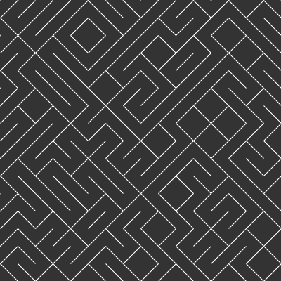10PrintLine](https://anuraghazra.github.io/CanvasFun/10PrintLine) | [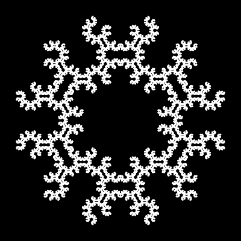ChaosGame](https://anuraghazra.github.io/CanvasFun/ChaosGame) | [circlePattern](https://anuraghazra.github.io/CanvasFun/circlePattern) | [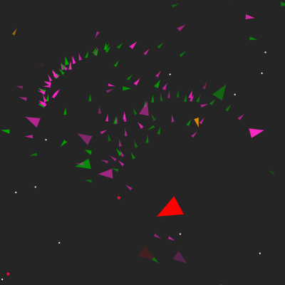EvolutionAquerium](https://anuraghazra.github.io/EvolutionAquerium) | [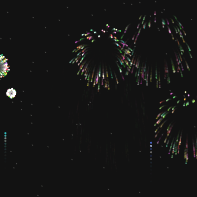fireworks](https://anuraghazra.github.io/CanvasFun/fireworks) | [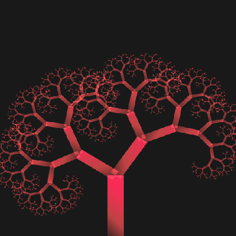fractalTree](https://anuraghazra.github.io/CanvasFun/fractalTree) | [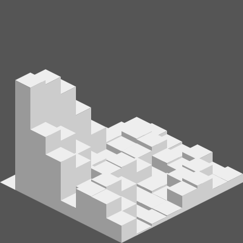isometric3D](https://anuraghazra.github.io/CanvasFun/isometric3D)
| --- | --- | --- | --- | --- | --- | --- |
[particleShift](https://anuraghazra.github.io/CanvasFun/particleShift) | [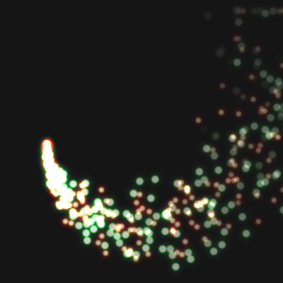particleSystem](https://anuraghazra.github.io/CanvasFun/particleSystem) | [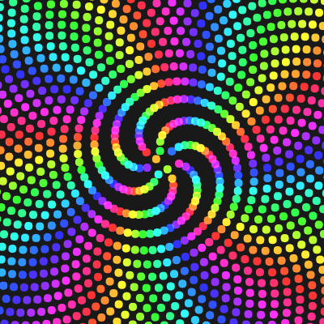phyllotaxis](https://anuraghazra.github.io/CanvasFun/phyllotaxis) | [sevenSegmentDisplay](https://anuraghazra.github.io/CanvasFun/sevenSegmentDisplay) | [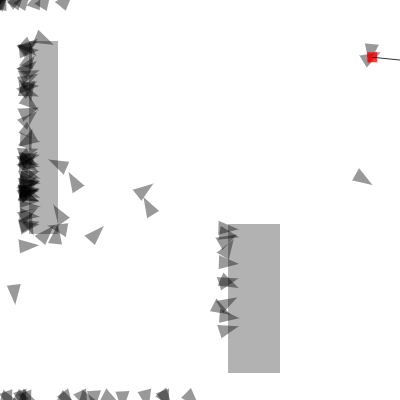smartRockets](https://anuraghazra.github.io/CanvasFun/smartRockets) | [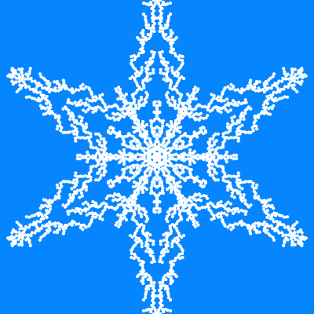snowFlake](https://anuraghazra.github.io/CanvasFun/snowFlake) | [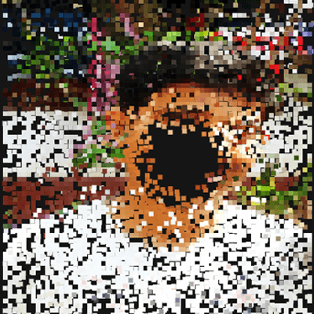TextParticles](https://anuraghazra.github.io/CanvasFun/TextParticles) | [KochStar](https://anuraghazra.github.io/CanvasFun/KochStar) | [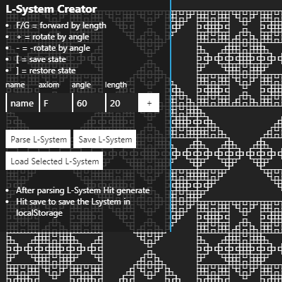LSystemCreator](https://anuraghazra.github.io/CanvasFun/LSystemCreator) | [LoveHearts](https://anuraghazra.github.io/CanvasFun/LoveHearts) | [LoveHearts](https://anuraghazra.github.io/CanvasFun/LoveHearts)

1. [10PrintLine](https://anuraghazra.github.io/CanvasFun/10PrintLine) 
2. [ChaosGame](https://anuraghazra.github.io/CanvasFun/ChaosGame) 
3. [circlePattern](https://anuraghazra.github.io/CanvasFun/circlePattern) 
4. [EvolutionAquerium](https://anuraghazra.github.io/EvolutionAquerium) 
5. [fireworks](https://anuraghazra.github.io/CanvasFun/fireworks) 
6. [fractalTree](https://anuraghazra.github.io/CanvasFun/fractalTree) 
7. [isometric3D](https://anuraghazra.github.io/CanvasFun/isometric3D) 
8. [particleShift](https://anuraghazra.github.io/CanvasFun/particleShift) 
9. [particleSystem](https://anuraghazra.github.io/CanvasFun/particleSystem) 
10. [phyllotaxis](https://anuraghazra.github.io/CanvasFun/phyllotaxis) 
11. [sevenSegmentDisplay](https://anuraghazra.github.io/CanvasFun/sevenSegmentDisplay)
12. [smartRockets](https://anuraghazra.github.io/CanvasFun/smartRockets) 
13. [snowFlake](https://anuraghazra.github.io/CanvasFun/snowFlake) 
14. [TextParticles](https://anuraghazra.github.io/CanvasFun/TextParticles) 
15. [KochStar](https://anuraghazra.github.io/CanvasFun/KochStar) 
16. [LSystemCreator](https://anuraghazra.github.io/LSystemCreator) 
17. [LoveHearts](https://anuraghazra.github.io/CanvasFun/LoveHearts) 
18. [metaBalls](https://anuraghazra.github.io/CanvasFun/metaBalls) 
19. [VerletDVDLogo](https://anuraghazra.github.io/CanvasFun/VerletDVDLogo) 
20. [fourierDrawing](https://anuraghazra.github.io/CanvasFun/fourierDrawing) 

### libs
* [Candy.js](https://github.com/anuraghazra/Candy.js)
* [p5js](https://github.com/processing/p5.js)
* [Vector](https://github.com/anuraghazra/CanvasFun/blob/master/src/lib/Vector.js) 